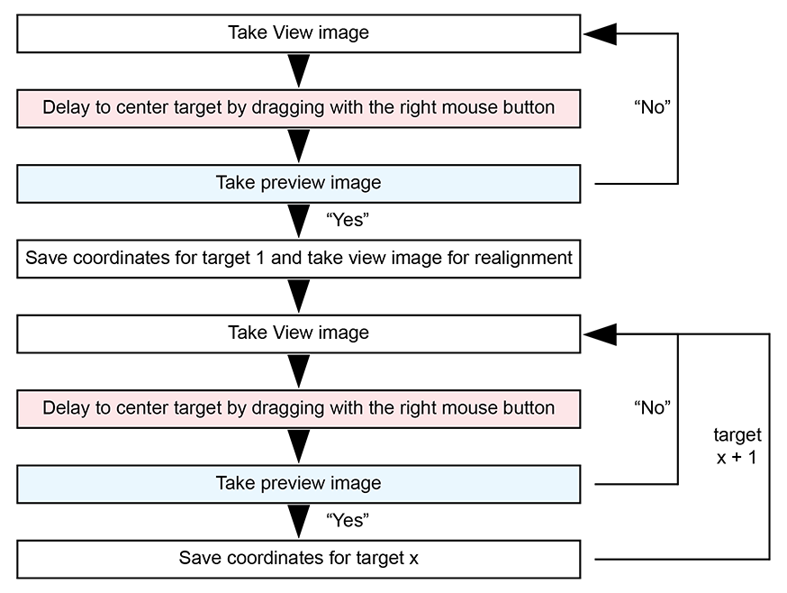

# PACE-tomo
Parallel cryo electron tomography (PACE-tomo) is a SerialEM script written in Python that allows for the collection of an arbitrary number of tilt series in parallel via beam image shift.
Please refer to the publication for more details.

### Citation

### Requirements
PACE-tomo does not require the installation of any stand-alone software. However, it does require SerialEM 4.0 or higher capable of running Python scripts.

You can run the following lines of code in a SerialEM script window to test if Python is configured correctly:

	#!Python
	import serialem as sem
	sem.OKBox("Python works!")

If you get an error message, please consult the [SerialEM website](https://bio3d.colorado.edu/SerialEM/hlp/html/about_scripts.htm#Python) on how to setup Python for SerialEM.

Additionally, you require the numpy and scipy modules for Python. Depending on your Python installation the following commands in the Windows Command Prompt should take care of it (you will need network connection):

	pip install numpy
	pip install scipy

To check if SerialEM has access to the modules, run this script inside a SerialEM script window:

	#!Python
	import serialem as sem
	import numpy as np
	from scipy import optimize
	sem.OKBox("All necessary modules are installed!")

To use PACE-tomo just copy the content of *PACEtomo.py* and *PACEtomo_selectTargets.py* in an empty SerialEM script slot each.

### Usage
Setup SerialEM low dose mode like you would for conventional tilt series acquisition. Make sure to set the appropriate [tilt axis offset](https://bio3d.colorado.edu/SerialEM/hlp/html/menu_tasks.htm#hid_tasks_settiltaxisoffset) (more details below). 

Before you run a PACE-tomo acquisition, you must define the targets using the *PACEtomo_selectTargets* script. 

**Caution:** To avoid problems with the SerialEM working directory, please choose the folder in which you save your frames before running the *selectTargets* script.

There are 3 ways to define targets:

1. Selecting targets by dragging the image and centring features of interest manually.
	- Inside the script, choose a *delaytime* for dragging the image before taking the next image.
	- Set all other settings to *False*.
	- Move the stage to your first target (tracking target).
	- In the SerialEM UI in the *Image Alignments & Focus* window, uncheck *Move stage for big mouse shifts*.
	- Run the script from the script window.
	- Choose the folder where all files related to PACE-tomo including the final tilt series are saved. This should be the same folder for all PACE-tomo acquisition areas if you plan to run them in batch via *Acquire at items*!
	- Choose a rootname for the current acquisition area. All files related with this acquisition area will be named accordingly.
	- The script will guide you to through the following process: 
 
2. Selecting targets by specifying relative image shifts in specimen coordinates.
	- The overall process is like 1., but instead of dragging to centre a target, you supply shifts in µm for X and Y that are applied from the current position to reach the next target. This is useful for (semi-)ordered patterns of targets.
	- Set only *targetByShift* to *True*. Set all other settings to *False*.
	- Move the stage to your first target (tracking target).
	- Run the script from the script window.
	- The script will guide you to through the process.

3. Selecting a target pattern that can be applied to arbitrary stage positions.
	- A target pattern is useful for the collection on regular holey support films and can be easily transferred to other stage positions.
	- Set *targetPattern* to *True*.
	- If you have a hole reference saved in buffer P and want to refine the manually entered grid vectors (*vecA* and *vecB*) according to hole positions, set *alignToP* to *True*.
	- Set *size* to the appropriate value n for your desired pattern (2n+1)x(2n+1), e.g. 2 for a 5x5 pattern.
	- Enter specimen shifts in x and y between neighbouring holes in *vecA*. *vecB* assumes a perpendicular pattern, but you can specify custom values as well.
	- One way to determine the specimen shift between holes:
		- Centre hole with stage (make sure image shift is 0)
		- Take view image and drag with the right mouse button to centre the neighbouring hole (make sure stage didn’t move).
		- Run the *ReportSpecimenShift* command in SerialEM and take the values output in the log window.
	- Run the script from the script window.
Once target selection is completed all targets are saved in the navigator and a *rootname_tgts.txt* file is created. Target 1 is set to *Acquire* and the name of the *rootname_tgts.txt* file is saved in its *Note* entry. 
**Caution:** Only target 1 of each PACE-tomo acquisition area should be set to *Acquire*!

Before starting the PACE-tomo collection, please check the settings inside the *PACEtomo* script. Most settings are self-explanatory, but here is a more detailed description for some of them:

- If a defocus range is given, PACE-tomo will use different target defoci (separated by *stepDefocus*) for each target. If you want to use the same target defocus, keep *minDefocus* and *maxDefocus* the same.
- By setting *addAF* to *True* you can add additional autofocus routines on target 1 at every branch switch of the dose-symmetric tilt series. This did not yield major improvements in the final defocus spread during testing.
- If your tilt axis offset is not appropriately set, there will be a pseudo-linear defocus slope throughout your tilt series. You can run PACE-tomo on a carbon film, estimate the defocus by CTF fitting and plot the change per degree. Set this value as *focusSlope* to compensate in subsequent acquisitions. Alternatively, refine the tilt axis offset to minimise the slope. In our case, when using SerialEM’s fine eucentricity routine to obtain the tilt axis offset, a significant focus slope remained.
- You can set delays to be applied after adjusting the image shift and after tilting. On modern state-of-the-art microscopes and resolutions typical of subtomogram averaging, such delays should not be necessary.
- The *pretilt* of the lamella (if applicable) is determined during the focused ion beam milling process and is usually between 8-12 degrees. The sign is important and depends on the orientation in which the grid was loaded into the microscope. 
- Small rotations of the lamella relative to the tilt axis are negligible. You can try to compensate for large rotations by setting an estimated value for *rotation*, but this was not tested for extreme cases.
- The number of *dataPoints* used for the calculation of the eucentric offset of each target was kept at 4 throughout all experiments. Changes could be beneficial to performance.
- The *alignLimit* should keep the cross-correlation alignment in check in cases of low contrast. On good stages the alignment error should never be worse than 0.5 µm.
- If you want to use PACE-tomo on a regular target pattern (e.g., holey support film), set *tgtPattern* to *True*. Additionally, set *alignToP* to *True* if you saved a hole template to buffer P to use for target alignment.
- *ignoreFirstNegShift* improves the alignment of the first tilt images from the negative branch and should generally be set to *True*.
- *slowTilt* should only be set to *True* if you need additional tilt backlash corrections for the positive tilt branch, which should not be necessary for modern stages.
- *previewAli* can be set to *True* if you want to align every target to its saved Preview image. This can be necessary for small fields of view, when it is important to centre your feature of choice. It can also be useful when transferring a “targetPattern” to a different stage position, where the holey support film might have slightly different grid vectors. In this case you should also have *alignToP* set to *True*.

You can run the PACE-tomo acquisition script either by selecting the entry of target 1 in the Navigator and pressing *Run* in the script window or you can run it in batch via the *Acquire at Items...* dialogue. In case you want to run PACE-tomo on a regular grid *targetPattern*, you can copy the *Note* entry from target 1 it was defined on to any other point in the Navigator, allowing for batch PACE-tomo acquisition.

### Output
All files are created in the folder you specified during target selection. Target images have the suffix *tgt_xxx* and collected tilt series have been saved with the suffix *ts_xxx* and their accompoanying *.mdoc* file.
