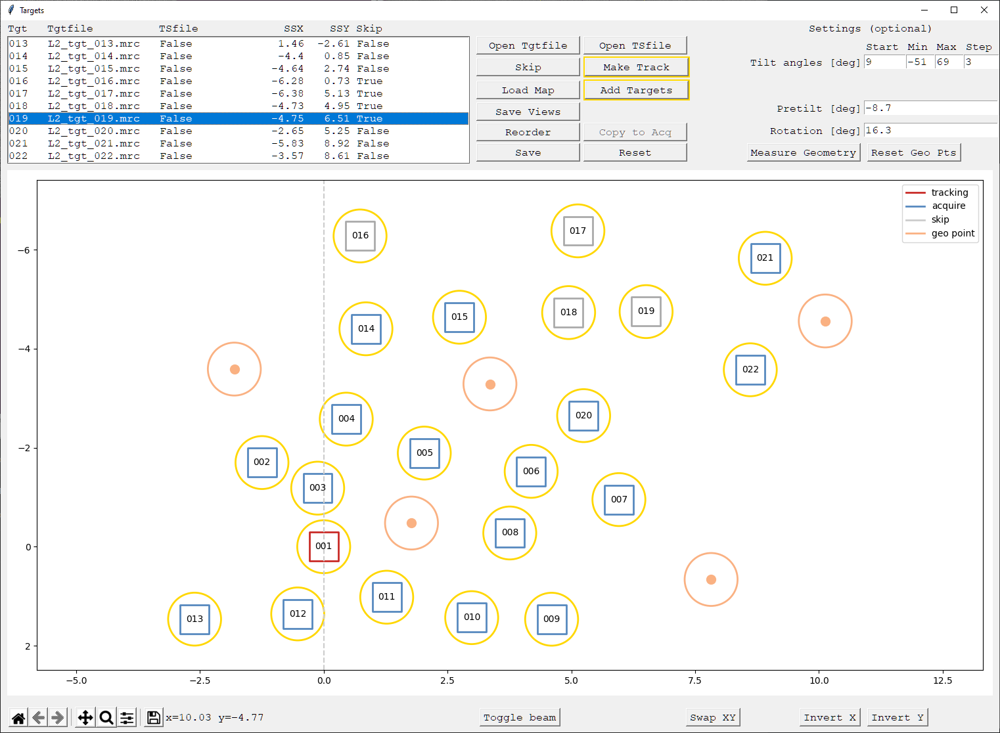

# PACEtomo

Parallel cryo electron tomography (PACEtomo) is a set of SerialEM scripts written in Python that allows the collection of an arbitrary number of tilt series in parallel via beam image shift. A key feature is the consideration of the sample geometry for the prediction of sample movement throughout a tilt series.
Please refer to the [publication](https://www.nature.com/articles/s41592-022-01690-1) ([pdf](https://rdcu.be/c0Qfm)) for more details.


## Contents

- [Hardware](#hardware)
- [Requirements](#requirements)
- [Usage](#usage)
	- [Target selection](#target-selection)
	- [Target editing](#target-editing)
	- [Acquisition](#acquisition)
	- [Output](#output)
	- [Recovery](#recovery)
	- [Auxiliary Scripts](#auxiliary-scripts)
- [Video tutorials](#video-tutorials)
- [Troubleshooting](#troubleshooting)
- [Recent changes](#recent-changes)

## Hardware

PACEtomo has been tested on a variety of high-end JEOL (F200, cryoARM 300) and Thermo Fisher Scientific (Krios G2, G3i, G4) instruments using the dedicated computer for the Gatan K2 or K3 direct electron detector. The open-source microscope control software [SerialEM](https://bio3d.colorado.edu/SerialEM/) should be installed and well calibrated.

## Requirements
PACEtomo does not require the installation of any stand-alone software. However, it does require SerialEM 4.1 or higher capable of running Python scripts.

You can run the following lines of code in a SerialEM script window to test if Python is configured correctly:
```python
#!Python
import serialem as sem
sem.OKBox("Python works!")
```
If you get an error message, please consult the [SerialEM website](https://bio3d.colorado.edu/SerialEM/hlp/html/about_scripts.htm#Python) on how to setup Python for SerialEM.

Additionally, you will require several Python modules. I highly recommend using the [miniconda](https://docs.conda.io/projects/miniconda/en/latest/) package manager. This will require network connection. Please contact your responsible IT specialist if it's possible to temporarily allow network connection or setup a proxy.

If everything goes well, you can install all dependencies by downloading the *SPACEenvironment.yaml* file and running the following line the Anaconda Prompt:

    conda env create -f <your path>\PACEenvironment.yaml

Alternatively, you can download the packages individually and install them using ```pip```. It might take some trial and error to satisfy all version compatibilities.

<details>
  <summary>Packages</summary>

  - [NumPy](https://numpy.org/install/)
  - [SciPy](https://scipy.org/install/)
  - [scikit-image](https://scikit-image.org/docs/stable/user_guide/install.html)
  - [Matplotlib](https://matplotlib.org/stable/)
  - [mrcfile](https://mrcfile.readthedocs.io/en/stable/readme.html#installation)

  Optional (needed in future versions and for [SPACEtomo](https://github.com/eisfabian/SPACEtomo)):
  - [DearPyGui](https://dearpygui.readthedocs.io/en/latest/tutorials/first-steps.html)
</details>

To let SerialEM access the correct Python environment, you have to adjust the ```PathToPython``` entry in the *SerialEM_properties.txt* file to include the Python path to your environment. More info [here](https://bio3d.colorado.edu/SerialEM/hlp/html/about_scripts.htm#Python)!

If everything is set up properly, you can run this script inside a SerialEM script window without any errors:
```python
#!Python
import serialem as sem
import numpy as np
from scipy import optimize
import matplotlib.pyplot as plt
import mrcfile
sem.OKBox("All necessary modules are installed!")
```

To use PACEtomo just copy the content of *PACEtomo.py* and *PACEtomo_selectTargets.py* as well as any auxiliary scripts you want to use in an empty SerialEM script slot each.

## Usage

### Preparation

For optimal results, load the sample such that the lamellae are oriented with the milling direction perpendicular to the tilt axis ([schematic for a Krios autoloader](img/gridOrientation.png)). Set up SerialEM low dose mode like you would for conventional tilt series acquisition. Make sure buffer O is outside the range of Roll Buffers (Buffer controls window). Offsets for *Focus* and *Trial* areas can be set to 0 to preserve specimen area. Make sure to set the appropriate [tilt axis offset](https://bio3d.colorado.edu/SerialEM/hlp/html/menu_tasks.htm#hid_tasks_settiltaxisoffset) (more details [below](#pacetomo_measureoffsetpy)). It is recommended to do a [coma-free alignment](https://bio3d.colorado.edu/SerialEM/hlp/html/menu_focus.htm#hid_focus_coma_by_ctf) and a [coma vs image shift calibration](https://bio3d.colorado.edu/SerialEM/hlp/html/menu_calibration.htm#hid_focustuning_comavs) to minimise beam tilt for large image shifts (you might need a carbon film to get nice power spectra for CTF fitting). However, in most cases beam tilt will not be resolution limiting.

### Target selection

Before you run a PACEtomo acquisition, you must define the targets using the *PACEtomo_selectTargets* script. 

Inside the script, there are several settings you can adjust before you start. If you set ```guidance``` to ```True```, message boxes will guide you through the target selection procedure. Once you are familiar enough with the steps, you can set ```guidance``` to ```False``` which should streamline the setup.

When picking targets in close proximity, it is useful to keep the illuminated area in mind as the stage is tilting. Set ```drawBeam``` to ```True``` to show an approximation of the exposure on your sample around selected targets. You can set a fixed ```beamDiameter``` or set it to ```0``` to use the IlluminatedArea value on Thermo Scientific microscopes. You can also adjust the simulated stretching of the beam for a tilted sample using the ```maxTilt``` value.

There is a variety of ways to select targets and their suitability will be sample and personal preference dependent.

1. **Manually: Selecting targets by dragging the image and centring features of interest.**
	- By default the script will use View mode to find targets. If you set *useSearch* to *True*, it will use Search mode instead.
	- Set ```targetByShift``` and ```targetPattern``` to ```False```.
	- If you want to choose your targets freely, just proceed with the next step. Alternatively, you can use a group of points as template for target selection:
		- Use *Add Points* in the Navigator to select points on a montage or a low magnification image.
  		- Select the **first** point of the group and run the script as described below.
	- Move the stage to your first target (tracking target), which should have enough contrast to be tracked confidently.
	- Run the script from the script window.
	- Choose the folder where all files related to PACEtomo including the final tilt series are saved. This should be the same folder for all PACEtomo acquisition areas if you plan to run them in batch via *Acquire at items*!
	- Choose a rootname for the current acquisition area. All files related with this acquisition area will be named accordingly.
	- The script will guide you step-by-step through the following process via message boxes: 
	- When dragging the image, make sure not to hit the "Shift" key as this will trigger stage movement.
	- When you do not add any more targets, the script will open a GUI window with an overview over all selected targets.
 
2. **Fixed shifts: Selecting targets by specifying relative image shifts in specimen coordinates.**
	- The overall process is like 1., but instead of dragging to centre a target, you supply shifts in µm for X and Y that are applied from the current position to reach the next target. This is useful for (semi-)ordered patterns of targets.
	- Set ```targetByShift``` to ```True```. Set ```targetPattern``` to ```False```.
	- Move the stage to your first target (tracking target).
	- Run the script from the script window.
	- The script will guide you through the process.

3. **Pattern: Selecting a target pattern that can be applied to arbitrary stage positions.**
	- A target pattern is useful for the collection on regular holey support films and can be easily transferred to other stage positions.
	- Set ```targetPattern``` to ```True```.
	- If you have a hole reference saved in buffer P and want to refine the grid vectors automatically according to hole positions, set ```alignToP``` to ```True```.
	- Set ```size``` to the appropriate value n for your desired pattern (2n+1)x(2n+1), e.g. 2 for a 5x5 pattern.
	- The procedure to determine the specimen shift between holes is integrated in the script:
		- Before running the script, roughly centre your central hole.
		- The script will align the hole using the reference in buffer P.
    - Using a View image, the hole pattern vectors will be automatically determined using autocorrelation.
		- In case the automatic procedure fails, you will be asked to drag with the right mouse button to centre the neighbouring hole of the grid.
		- The script will then automatically refine the vectors of the hole pattern using the reference in buffer P.
	- The script will determine the coordinates of all targets and open the GUI for target editing.

4. **Polygon: Filling an area with a regular pattern of targets.**
   - You can draw a polygon to outline a collection area of interest using the Navigator. This might be useful to cover a large area (e.g. lamella) homogenously in targets. (Right now the grid is orthogonal. Consider using [SPACEtomo](https://github.com/eisfabian/SPACEtomo) for exhaustive lamella acquisition.)
   - Set ```targetPattern``` to ```True``` and ```alignToP``` to ```False```.
   - You can keep ```vecA``` and ```vecB``` at ```(0, 0)``` and set the rotation of the target grid using ```patternRot```. This will use the beam diameter to place targets far enough apart. Alternatively, you can define the grid vectors in specimen coordinates (µm, x along tilt axis).
   - You can change the ```beamDiameter``` setting to spread out the targets.
   - The ```maxTilt``` setting is used to scale the distance between the targets perpendicular to the tilt axis.
   - Select your drawn polygon in the Navigator and run the script from the script window.
   - Choose the first (tracking) target as described for manual target selection.
   - The script will automatically fill in the rest of the polygon according to the determined target grid vectors with the tracking target as origin and open the GUI for target editing.
   - Note: No preview images will be saved for your targets and hence, the collection might be slightly off the targets shown. You can use the *Save Views* function in the GUI to save view images for every point and set ```viewAli``` to ```True``` in the PACEtomo script to use the view images for initial target alignment.

5. **Virtual maps (experimental): Pick targets without taking new images.**
   - Using the *PACEtomo_targetsFromMontage.py* instead, you can crop out images from a View mag montage to serve as target references (similar to [py-EM](https://www.nature.com/articles/s41592-019-0396-9)). This can speed up target selection dramatically, but requires good contrast at low-defocus View mag for precise realignment. Good applications are lacey carbon support or similarly strong non-repetetive features.
   - Collect a View mag montage of your target area.
   - *Add points* using the navigator. The first point will be considered the tracking target.
   - Select the first point and run the *PACEtomo_targetsFromMontage.py* script from the script window. (Also works when running SerialEM in DUMMY mode.)
   - You can run the script on several groups of points using *Acquire at Items* if you check "Skip stage move to item if possible". You can automate the file naming by setting ```noUI``` to ```True```.
   - If you want to edit target using the GUI, you can select the tracking target in the navigator and run the *PACEtomo_selectTargets.py* script from the script window.

6. **SPACEtomo: Automatic target setup on lamellae.**
   - [SPACEtomo](https://github.com/eisfabian/SPACEtomo) can automatically set up targets on lamellae and acquire them on multiple grids at a time.

All targets are saved in the navigator and a *rootname_tgts.txt* file is created. Target 1 is set to *Acquire* and the name of the *rootname_tgts.txt* file is saved in its *Note* entry.

### Target editing

Once target selection is completed a GUI will open showing a schematic of your targets and some additional information. This GUI will also open if you select a navigator item with an already associated target file and run the target selection script. It allows you to view, edit, add targets and specify settings for acquisition.



The main components are a list of all targets with associated file names, image shifts and *skip* flag, and a plot of all targets with the origin at the tracking target.

You can select targets by left clicking them in the list or in the plot. Right clicking targets in the plot toggles their *skip* flag. While you cannot delete targets, setting *skip* to *True* ensures they will be ignored during acquisition.

*Make Track* can be used to make the selected target the tracking target instead. This requires some realignment and hence, additional Preview exposures on the new tracking target. Use with caution!

*Load Map* prompts you to enter a navigator label and will load the associated map in SerialEM. This is useful when you want to load a montage to get an overview over your target area. It will also load a binned version of the map inside the GUI and **roughly** align it with the target plot. This is meant to give you a better idea to choose points for geometry measurement. If you want to inspect target placement, please refer to the map loaded in the SerialEM window.

*Add Targets* will realign to your tracking target and re-enter the target selection loop.

*Save Views* will take a View image at every target position and save it as a map. It will also save a JPG snapshot of the map with all navigator items marked. This might be useful to revisit the wider context of a tomogram after reconstruction. In the future, these view images containing centred targets could be potentially used to train a neural network for automated picking of target regions.

If you used SPACEtomo to setup targets, each target received a score. *Color by Score* will use this score to color the targets according to their score.

*Reorder* will read the current order of targets displayed in the list. You can change the order by dragging and dropping.

*Copy to Acq* is only accessible when *targetPattern* was used for target selection. It will copy the target file for all points in the navigator that have been set to acquire (excluding points already associated with a target file).

*Save* will save all changes to the target file. *Reset* will reset changes made since the GUI was opened (except changes to the tracking area).

*Settings* can be saved in the targets file and overwrite values given in the *PACEtomo.py* script.

Another feature of the GUI is the *Measure geometry* procedure. This automates the estimation of *pretilt* and *rotation* on your sample. Basically, it measures the defocus at >3 points on the sample and fits a plane to estimate values for *pretilt* and *rotation*. You can select these points directly on the plot using the middle mouse button. Make sure to avoid targets to prevent additional exposures of areas of interest. Ideally, five or more points should be spread evenly across the sample area while dark spots, ice chunks and holes are avoided.
You can reset the point selection using the *Reset geo pts* button and once you selected your points you can press *Measure geometry*. The estimated *pretilt* and *rotation* will be filled into the associated text fields, but you still have to save them to the targets file.

For *targetPattern* selections geo points are automatically suggested. However, geometry values might not be applicable if you plan to use the pattern on different stage positions. For that purpose, the *PACEtomo.py* script has an automated routine using the suggested points to measure the geometry at every stage position before starting the acquisition (more details below).

In the bottom left you can find the visual controls for the plot.

On the right, you can find *Toggle beam* to show or hide the beam diameter visualization, and buttons to swap or mirror the axes to make the plot fit your SerialEM view.

If you made any changes, please don't forget to click *Save*. Once you are done you can close the window and a message box will tell you the number of selected targets.

**Caution:** Only target 1 of each PACEtomo acquisition area should be set to *Acquire*!

### Acquisition

PACEtomo runs a grouped dose-symmetric tilt scheme. Before starting the PACEtomo collection, please check the settings inside the *PACEtomo.py* script. Most settings are self-explanatory, but here is a more detailed description for some of them:

- The ```startTilt``` in degrees is usually 0 or, in case of a lamella, the compensating tilt for the ```pretilt``` (in case of a ```pretilt``` of -10 degrees, a ```startTilt``` of 10 degrees can be used). The ```startTilt``` has to be divisible by the tilt ```step```.
- The tilt range is given by the absolute ```minTilt```, ```maxTilt``` and ```step``` values in degree. The tilt series branches do not have to be symmetrical.
- The number of contiguously acquired tilt images on one branch of the tilt series can be set with the ```groupSize``` parameter. 
- If a defocus range is given, PACEtomo will use different target defoci (separated by ```stepDefocus```) for each target. If you want to use the same target defocus, keep ```minDefocus``` and ```maxDefocus``` the same.
- If your tilt axis offset is not appropriately set, there will be a pseudo-linear defocus slope throughout your tilt series. You can run PACEtomo on a carbon film, estimate the defocus by CTF fitting and plot the change in µm per degree. Set this value as ```focusSlope``` to compensate in subsequent acquisitions. Alternatively, refine the tilt axis offset to minimise the slope. When using SerialEM’s fine eucentricity routine to obtain a tilt axis offset, a significant focus slope remains. You can use the [*PACEtomo_measureOffset.py*](#pacetomo_measureoffsetpy) script to get a PACEtomo optimised estimate for the tilt axis offset.
- You can set delays to be applied after adjusting the image shift and after tilting. On modern state-of-the-art microscopes and resolutions typical of subtomogram averaging, such delays should not be necessary.
- ```zeroExpTime``` can be a custom exposure time in seconds for the first tilt image. This can be useful for hybrid processing approaches. When set to ```0``` the same exposure time will be used for all tilt angles.
- ```zeroDefocus``` can be a custom target defocus for the first tilt image. When set to ```0``` the same target defocus will be used for all tilt angles.

Track settings:
- ```trackExpTime``` allows for a custom exposure time used only for the tracking tilt series. When set to ```0``` the same exposure time will be used for all tilt series.
- ```trackDefocus``` allows for a custom defocus value used only for the tracking tilt series. When set to ```0``` the same defocus range will be used for all tilt series.
- ```trackMag``` allows for custom magnification used only for the tracking tilt series. This should only be necessary on bad stages.
- If ```trackTwice``` is set to ```True```, a second tracking image might be taken in case of a large shift. This causes significantly more exposure on the tracking tilt series and should only be necessary on bad stages.

Geometry settings:
- The ```pretilt``` of the lamella (if applicable) is determined during the focused ion beam milling process and is usually between 8-15 degrees. The sign is important and depends on the orientation in which the grid was loaded into the microscope. For example, in case of a FIB milling angle of 10 degrees: If the lamella appears thinner/brighter at +10 degrees stage tilt angle, the pretilt value should be -10 degrees and vice versa. (It is recommended to load lamella containing grids consistently in the same orientation.) You can use the *measure geometry* routine in the target selection GUI to get an estimate of your lamella (or holey support) geometry.
- Lamellae should be oriented with the milling direction perpendicular to the tilt axis during sample loading. In this case the ```rotation``` should be 0 degrees. If there is a residual rotation you can estimate and enter it for the initial estimation of the eucentric offset (CCW = positive).
- If *geo points* were defined during target selection or *targetPattern* was used, setting ```measureGeometry``` to ```True``` will allow PACEtomo to estimate the sample geometry immediately before acquiring an area. For target patterns, the script will automatically determine five points between the targets to measure the defocus and estimate the *pretilt* and *rotation* values of the sample support. This can be useful for bent sample supports exhibiting varying geometries from grid square to grid square. It should be avoided if the pattern is tight and additional exposures within the grid would overlap with target positions. It is also needed for SPACEtomo.

Holey support settings:
- If you want to use PACEtomo on a regular target pattern (e.g., holey support film), set ```tgtPattern``` to ```True```. Additionally, set ```alignToP``` to ```True``` if you saved a hole template to buffer P to use for target alignment.
- If ```refineVec``` is set to ```True```, PACEtomo uses the template in buffer P to refine the grid vectors of the target pattern at the current position. The grid of holes can vary slightly from grid square to grid square, which can become problematic for large target patterns (7x7 or larger).
- If ```refineGeo``` is set to ```True```, PACEtomo will try to refine the sample geometry model after the first Record image of every target was taken. It will use the defoci determined by CTF estimation to fit a plane or paraboloid and overwrite the previously determined geometry estimation. This is useful for large target patterns (7x7 or larger) on bent or wavy support film. More settings for ```refineGeo``` are mentioned below.


Session settings:
- ```beamTiltComp``` should be set to ```True``` if you did the [coma vs image shift calibration](https://bio3d.colorado.edu/SerialEM/hlp/html/menu_calibration.htm#hid_focustuning_comavs).
- By setting ```addAF``` to ```True``` you can add additional autofocus routines on target 1 at every branch switch of the dose-symmetric tilt series. This should help keeping the defocus spread low at the cost of overexposing the tracking tilt series.
- ```previewAli``` can be set to ```True``` if you want to align every target to its saved Preview image. This helps to keep your target centred if your ```startTilt``` is not 0. If your field of view is large and your feature of choice does not have to be centred precisely, ```previewAli``` can be set to ```False``` to reduce the initial dose on your targets. ```previewAli``` can also be used for a “targetPattern” if the grid is not very regular and vectors alone are not precise enough. In this case you should also have ```alignToP``` set to ```True```.
- ```viewAli``` works similar to ```previewAli``` but only uses a View mag image for initial alignment to save exposure on the targets. If you rely on View images taken with high defocus offset, it is recommended to do the "High-Defocus Mag" and especially the "High-Defocus IS" calibrations. It is also used for SPACEtomo.

Advanced settings:
- The tilt series stacks are saved in order of acquisition. If you want to resort the stacks by tilt angle after acquisition, set ```sortByTilt``` to ```True```. This will also resort the accompanying mdoc files, but keep unsorted versions for dose filter considerations.
- CTF estimation is done for every Record image and the defocus is written to the .mdoc file. CTFfind is integrated in SerialEM and is used when ```doCtfFind``` is set to ```True```. It is fast, but not very reliable especially at higher tilt angles. IMOD's ctfplotter is more robust and now also integrated in SerialEM. You can use it by setting ```doCtfPlotter``` to ```True```. Currently, CTF estimation is only used for ```refineGeo```.
- If you use ```refineGeo```, ```fitLimit``` is the resolution cut-off beyond which CTF estimates will not be considered for the geometry refinement routine. ```parabolTh``` is the minimum threshold of available CTF estimates to fit a paraboloid instead of a plane.
- SerialEM has a hard limit on applying image shifts, which is 15 µm by default. ```imageShiftLimit``` will overwrite this SerialEM property. The maximum amount of image shift is system dependent and the limit for Thermo Scientific TEM systems is always somewhere below 25 µm.
- The number of ```dataPoints``` used for the calculation of the eucentric offset of each target was kept at 4 throughout all experiments. Changes could be beneficial to performance but have not been extensively explored.
- The ```alignLimit``` should keep the cross-correlation alignment in check in cases of low contrast. On good stages the alignment error should never be worse than 0.5 µm.
- If you set ```minCounts``` greater than 0, a branch of a target can be terminated independently if the image mean counts were below the threshold. The counts are considered per second of exposure and the ```ReportExposure``` command in SerialEM 4.0+ is used to obtain the exposure time.
- ```ignoreFirstNegShift``` usually improves the alignment of the first tilt images from the negative branch and should generally be set to ```True```.
- ```slowTilt``` should only be set to ```True``` if you need additional tilt backlash corrections for the positive tilt branch, which should not be necessary for good stages.
- ```taOffsetPos``` and ```taOffsetNeg``` allow you to apply additional tilt axis offsets for positive and negative branches, respectively (as used for the side-entry holder dataset in the manuscript). These offsets are applied on top of the global offset set in SerialEM and are only used for the internal calculations.
- ```extendedMdoc = True``` saves additional information like estimated defoci from CTF fitting, specimen shifts and eucentric offset estimations to the mdoc files.
- ```checkDewar``` will check if the microscope dewars are filling before taking a Record image. (Can cause weird behaviour on some microscope without a dewar.)
- If you are using a JEOL cryoARM, set ```cryoARM = True``` to always fill both dewars at the same time.
- If you are using a coldFEG, set ```coldFEG = True``` to flash the gun regularly according to the ```flashInterval``` in hours. (On a Krios, the interval is ignored and the *FlashingAdvised* function is used instead.)
- If you are using a large target pattern with collection times of several hours, it might not be sufficient to run the alignment of the energy filter slit between acquisition areas. If you set ```slitInterval``` to a number (in minutes) greater than 0, the script will move to a position out side the target pattern to run *RefineZLP* before continuing acquisition.

Target montage settings:
- If you want to collect a montage tilt series for each target instead of a single image tilt series, you can set ```tgtMontage``` to ```True``` and set the size and overlap with ```tgtMntSize``` and ```tgtMntOverlap```, respectively. The montage uses the shorter camera length to determine the tile displacement. This was implemented for use with a square beam (square C2 aperture).
- ```tgtMntFocusCor``` lets you apply an additional focus offset between the tiles to compensate for the tilt angle dependent z-offset. This might require additional processing considerations when reconstructing the tomogram.
- ```tgtTrackMnt``` determines if the tracking tilt series should also be a montage or not.
    
Any numerical setting in the script can be overwritten by settings in the target file (*rootname_tgts.txt*). This allows for varying settings during batch acquisition of several PACEtomo areas. To overwrite a setting add a line like ```_set varName = numericalValue``` at the beginning or end of the targets file.

You can run the PACEtomo acquisition script either by selecting the entry of target 1 in the Navigator (its Note entry contains *rootname_tgts.txt*) and pressing *Run* in the script window or you can run it in batch via the *Acquire at Items...* dialogue. In the latter case, you can uncheck any eucentricity and realign checkboxes as the script will take care of it.

In case you want to run PACEtomo on a regular grid *targetPattern*, you can set all desired tracking stage positions to *Acquire* in the navigator and run the *PACEtomo_selectTargets.py* script on the original navigator item. Within the GUI, you can click *Copy to Acq* to copy the target file to all marked points. Alternatively, you can copy the targets file manually and edit the *Note* entry of all target positions to contain the target file name.

### Output
All files are created in the folder you specified during target selection. Target images have the suffix *tgt_xxx* and collected tilt series have been saved with the suffix *ts_xxx* and their accompanying *.mdoc* file. Additionally, a *rootname_tgts_runXX.txt* is created containing all information to restart an acquisition after it was aborted or crashed. The *.log* file is saved for every PACEtomo run individually.

### Recovery
In case a PACEtomo run crashes or is aborted, you can attempt to recover and resume the acquisition. Run the *PACEtomo.py* script on the same navigator item and if a *run* file is present, it will ask you if you want to recover the run. Recovery will likely not track as accurately as a continuous run for the first few images. Especially if time passed or the stage was moved between crash and recovery attempt.

If you feel confident in the recovery capabilities, you can stop an acquisition, run the *PACEtomo_selectTargets.py*, use the GUI to set targets to be skipped or even change the tilt angle range, and resume the acquisition.

### Auxiliary scripts

#### [*PACEtomo_measureOffset.py*](https://github.com/eisfabian/PACEtomo/blob/main/PACEtomo_measureOffset.py)
SerialEM usually estimates the tilt axis offset using y-displacements measured during the fine eucentricity routine, which yields suboptimal results for PACEtomo. This script will estimate the tilt axis offset optimized for movement along the z-axis during tilting <sub>(Thanks to Wim Hagen for the suggestion!)</sub>. It will use SerialEM's autofocus routine to measure the z-height at 3 (or more) positions (on tilt axis and ± the given ```offset```) throughout a limited tilt series (given by ```increment``` and ```maxTilt```). The results should be within 0.1-0.2 µm of the optimal position for PACEtomo and you can adjust it depending on the focus slope you observe during a PACEtomo run.
- How to use:
  - You can use the default values or adjust the ```maxTilt``` and tilt ```increment``` for more or less datapoints used in the estimation.
  - Make sure that there are no dark images or holes where the script runs the autofocus routine.
  - It will show you 3 tilt axis offsets for the different positions and an average tilt axis offset. The results are relative to the offset already set in SerialEM.
  - Let the script set the estimated tilt axis offset or set the tilt axis offset in SerialEM (-> Tasks -> Eucentricity -> Set Tilt Axis Offset).
  - Make sure "Center image shift on tilt axis" is checked in the "Image Alignment & Focus" window.
  - Run the script again to see if there is a remaining offset.

#### [*PACEtomo_measureGeometry.py*](https://github.com/eisfabian/PACEtomo/blob/main/PACEtomo_measureGeometry.py)
This script uses a group of navigator points, measures the z-height using the autofocus routine at these points and estimates *pretilt* and *rotation* values for the sample assuming all points are on a plane. These values should give you an estimate of the sample geometry, but don't account for sample deformations. The more points you select, the better the fit should get (5-9 data points should be sufficient).
- How to use:
  - Use Add Points in the Navigator to select points (at least 3) on a montage or a low magnification image. **Caution:** Make sure not to expose areas you want to image later!
  - The first point will be used as the stage position so it should be somewhat centred.
  - Make sure to not surpass the beam shift limits of the microscope (usually within 20 μm).
  - Select the first point of the group and run the script.
 
## Video Tutorials
A selection of video tutorials was uploaded to Youtube. These were recorded using older versions of PACEtomo and some features and settings might be missing. The general workflows, however, remain the same.

[](https://www.youtube.com/watch?v=xpmizxNeQRc)
[](https://www.youtube.com/watch?v=ccONw8sPVU4)
[](https://www.youtube.com/watch?v=Gu2MQX9JD1o)
[](https://www.youtube.com/watch?v=Y8d1zL1oFUA)
[](https://www.youtube.com/watch?v=m99Cn8SI_ww)
[](https://www.youtube.com/watch?v=7NtngkPqAxY)

## Troubleshooting
- Some of you targets are being skipped: Double check if you want to collect targets with such high image shifts. If yes, change the ```imageShiftLimit``` setting in the PACEtomo acquisition script accordingly.
- The script just stops without a message. This can happen on microscopes without automated Dewar refill function. Try to set ```checkDewar``` to ```False```.
- "Cannot open the selected File": Make sure no other program is accessing the tilt series files during collection. (For example, a program automatically transfering the data. This can sometimes cause SerialEM to have trouble opening some files.)
- Images show edges of holes despite vector refinement with hole reference: If the defocus offset for the view mag is large, the image shift calibrations between mags might not be valid anymore. Try lowering the defocus offset or recalibrate the image shifts for large defocus offsets. Especially the "High-Defocus Mag" and especially the "High-Defocus IS" calibrations also help to keep a feature centered when switcing from *View* to *Record* state.
- to be continued...

## Recent changes

### 21.05.2024
#### PACEtomo.py [v1.8]
More bug fixes and quality of life improvements.
<details>
<summary>Changes</summary>

- Added grouped dose-symmetric tilt scheme.
- Added ```zeroDefocus``` to record first tilt image at lower defocus for hybrid schemes.
- Changing frame names according to tilt series name.
- Sort tilt series by tilt angle after acquisition.
- Making use of colored SerialEM logs.
</details>

#### PACEtomo_selectTargets.py [v1.8]
More bug fixes and quality of life improvements.
<details>
<summary>Changes</summary>

- Added loop for taking Preview images during target setup.
- Fixed realignment issues during calls from GUI.
- Fixed orientations in GUI.
</details>

### 12.12.2023
#### PACEtomo.py [v1.7]
Mostly small fixes and quality of life improvements.
<details>
<summary>Changes</summary>
	
  - Added status line updates to check on progress more easily.
  - Tracking of PriorRecordDose for all targets in the mdoc files (not tested yet).
  - Added SerialEM version check.
  - Added option for auto ZLP centering when using a target pattern (automatically uses a position slightly outside the target pattern).
  - Added target montage acquisition (collect NxN montage at every target position instead of single image).
  - Removed split log function as SerialEM now automatically prunes the log file.
  - Added additional warnings.
  - Fixed CTF fitting target defocus range being too wide.
  - Changed default setting from CTFfind to CTFplotter, which is now available in SerialEM without additional installation.
  - Minor text fixes.
</details>

#### PACEtomo_selectTargets.py [v1.7]
Mostly small fixes and quality of life improvements.
<details>
<summary>Changes</summary>
	
  - Made grid vector finding more robust.
  - Loading of maps into GUI (still  a bit slow and imprecise but helps with setting geo points).
  - Added support for SPACEscore.
  - Changed grid setup to spiral pattern instead of row-wise.
  - Minor text fixes.
</details>

### 28.04.2023
#### PACEtomo.py [v1.6]
This update includes mainly options for more robust tracking (e.g. for cryoARMs), CFEG functions and bug fixes.
- Notes:
  - When using lower mag tracking, make sure the record beam settings still cover the camera!
  - The CFEG flashing for TFS instruments was not tested!
<details>
<summary>Changes</summary>
	
  - Added mag offset for tracking tilt series.
  - Added trackTwice option to take a second tracking shot if the alignment was bad.
  - Output file containing all script settings.
  - Fixed progress not considering skipped targets.
  - Added check for existence of ComaVsIS calibration.
  - Added overwriting of existing tilt series file when restarting an acquisition (not for recovery).
  - Changed initial target alignment of targetPattern collection to only use View mag.
  - Added defocus offset for previewAli to boost contrast.
  - Added specimen coords obtainable from stage coords in tgts file. This allows for more flexible creation of tgts file in dummy mode.
  - Switched from targeted tilt angle to microscope tilt angle value when predicting specimen movement.
  - Added sanity check warning boxes.
  - Added functions for CFEG flashing.
  - Minor text fixes.
</details>

#### PACEtomo_selectTargets.py [v1.6]
Lots of bug fixes, addition of target setup from polygons and initial grid vector estimation.
<details>
<summary>Polygon setup</summary> 
	
  - Draw the desired polygon using the navigator.
  - Move the stage to your desired tracking position.
  - Prepare the selectTargets script:
    - Set *targetPattern* to *True* and *alignToP* to *False*.
    - You can change the *beamDiameter* setting to spread out the targets.
    - The *maxTilt* setting is used to scale the distance between the targets perpendicular to the tilt axis.
    - You can rotate the grid vectors using the *patternRot* setting.
  - Run the script on the polygon item in the Navigator. 
  - You will be asked if you want to run the polygon setup if the script detected the polygon properly.
  - Select your tracking target as usual by dragging the image and confirming the target selection.
  - A grid of points will be created to fill the polygon starting from the tracking target as origin.
  - Note: No preview images will be saved for your targets and hence, the collection might be slightly off the targets shown. You can use the *Save Views* function in the GUI to save view images for every point and set *viewAli* to *True* in the PACEtomo script to use the view images for initial target alignment.
</details>
<details>
<summary>Changes</summary>
	
  - Added initial vector estimation for targetPattern using auto-correlation (needs at least 9 holes in the field of View).
  - Added targetPattern setup to fill a polygon using beamDiameter as distance between targets (needs some testing).
  - Fixed being able to unskip skipped targets and continue run.
  - Added progress bars for some GUI functions.
  - Switched to specimen to stage conversion matrix to avoid coordinate inversion on some systems.
  - Added counter in case tgts file already existed.
  - Added view files being saved to tgts file to use for initial target alignment (optional).
  - Fixed measureGeometry outputting only negative pretilts.
  - Added sampleName as additional prefix for all files.
  - Minor text fixes.
</details>

#### PACEtomo_targetsFromMontage.py [v0.10]
This script can use a medium mag montage to crop out virtual maps as targets (similar to [py-EM](https://www.nature.com/articles/s41592-019-0396-9)). It is still experimental and works decently well on high-contrast features.
Huge thanks to Zhengyi Yang for doing a lot of testing and troubleshooting!
<details>
	
- How to use:
  - On top of the PACEtomo dependencies, this script requires the [mrcfile](https://pypi.org/project/mrcfile/) and the [scikit-image](https://pypi.org/project/scikit-image/) packages.
  - Collect a montage of your target area.
  - Add points using the navigator (as one group). The first point will be considered the tracking target.
  - Run the script on a point.
  - You can also run the script in the dummy version. Any error/warning messages can be ignored.
    - WARNING: There seems to be cross talk between the DUMMY instance and the real instance of SerialEM when running DUMMY on the microscope computer. I'm not sure if that's a new bug or if that's always been the case. I tested the script in a DUMMY version running on a separate computer.
  - You can run the script on several groups of points using Acquire at Items if you check "Skip stage move to item if possible". You can automate the file naming by setting *noUI* to *True*.

Please let me know if you run into any issues or have any feature requests. If there is enough interest, I will work on this further!
</details>

### 28.09.2022
#### PACEtomo.py [v1.4]
<details>
	
- This update introduces the option to resume a PACEtomo run, allowing for abortion of a subset of targets and change of maximum tilt angles after a run was started. It also automates some functions to improve setup on holey support films. 
- Changes:
  - Saving of essential values into a *run* file throughout acquisition enables recovery of the run. Presence of a run file is automatically detected, but a recovery attempt has to be confirmed by the user. This *run* file is also loaded when the target selection script is run on a nav item with a *run* file. The GUI can be used to edit targets and settings before resuming the run.
  - Automatic pattern vector refinement and sample geometry measurement is now available for *targetPattern*. This allows for copying of the target file to other stage positions without worrying about slightly rotated or distorted hole patterns and tilted support films. These effects are exacerbated for large patterns (7x7 and greater).
  - Added *trackExpTime* and *trackDefocus* to use deviating exposure time and/or defocus only for the tracking target.
  - Allowed for continuation of single tilt series branch after one is completed. *minTilt* and *maxTilt* are now absolute values and not relative to *startTilt* anymore.
  - IMOD's ctfplotter can now be used for CTF estimation, which is more reliable (but slower) than CTFfind.
  - Fixed crash caused by occasional CTFfind failure.
  - Removed timestamps from end of file names on *targetPattern* runs.
  - Minor text fixes.
</details>
	
#### PACEtomo_selectTargets.py [v1.5]
<details>
	
- Big update to streamline target selection and flexibly edit targets.
- Changes:
  - Keybreak: Instead of a fixed delay time before the next image is taken, the script waits for a key input to move on.
  - Guidance: You can turn off most repetitive message boxes making target selection more streamlined. This relies on timed key presses for interaction.
  - GUI: New GUI displays target information and allows editing of target files.
  - Integrated semi-automatic determination of sample geometry (pretilt and rotation).
  - Integrated procedure to determine vectors of target pattern on holey carbon supports.
  - Integrated function to copy target pattern file to other navigator points. This will make a copy of the targets file for every stage position instead of reading from the same file as done previously (which removes the necessity for timestamps at the end of file names).
  - Using new SerialEM navigator commands to create polygons instead of parsing and overwriting the navigator file.
  - Bug fixes.
  - Minor text fixes.
</details>details>

#### PACEtomo_measureOffset.py [v1.1]
<details>
	
- Changes:
  - Allows list of offsets to have more data points for fitting the tilt axis offset.
  - Outputs total tilt axis offset instead of tilt axis offset relative to currently set value.
  - Asks to apply measured offset directly.
  - Minor text fixes.
</details>

### 22.07.2022 and earlier
#### PACEtomo.py [v1.3]
<details>
	
- This update includes a new optional geoRefine procedure to refine the geometrical sample model. GeoRefine uses the defocus estimated by SerialEM's CTFfind at every position's start tilt angle record image. Using these defoci it fits a plane or a paraboloid and overwrites the user given plane. Results are very much dependent on the reliability of the CTF fit and overall are probably only worth it for large collection areas (7x7 holes or more, see figure of 9x9 fit below) yielding nice FFTs. This feature was not extensively tested yet! Please use at your own discretion! Feedback and bug reports are appreciated! 
<p align="center">
  
</p>

- Usage: Set *geoRefine* to *True*. PACE-tomo will fit the CTF after the first Record images are taken and only use values that show a fit better than the *fitLimit* value. If 3 points or more remain it will fit a plane, if *parabolTh* (default: 9) or more values remain, it will fit a paraboloid.
- Other changes:
  - Added progress bar and remaining time estimate.
  - Added *zeroExpTime* setting to set deviating exposure time for the start tilt image.
  - Added *checkDewar* and *doCtfFind* options to turn them off in case they cause problems.
  - Minor text fixes.
</details>

#### PACEtomo_selectTargets.py [v1.4]
<details>
	
- Small update to the target selection script, which still needs some more testing.
- Changes:
  - Draws beam at tilted stage (ellipse) around targets during manual selection using the *beamDiameter* and the *maxTilt* settings. If the *beamDiameter* is set to 0 the script will attempt to read it from the microscope illuminated area value, which is only available on Thermo Scientific microscopes like the Krios. **WARNING:** To draw the beam diameter this script will add a polygon item to the navigator file and reload the navigator. Be careful and maybe make a backup of the navigator file to be safe!
  - New warning when you select a target close to the SerialEM image shift limit (default: 15 microns).
</details>

#### PACEtomo [v1.2]
<details>
	
- Added independent abort of a target's tilt series branches in case of image shift approaching the limit or optionally in case of dark images (*minCounts* setting).
- Numerical settings in the script can now be overwritten by settings in the target file. This allows for varying settings during batch acquisition of several PACE-tomo areas.
- Added option to apply additional tilt axis offsets for positive and negative branches as used for the side-entry holder dataset in the manuscript (*taOffsetPos* and *taOffsetNeg* settings). These offsets are applied on top of the global offset set in SerialEM and are only used for the internal calculations.
- Additional consideration of the *rotation* value should improve performance especially when estimating the geometry of a support film.
- Changed alignment buffer from M to O to allow for more Roll buffers.
- Minor text fixes.
</details>
	
#### PACEtomo_selectTargets.py [v1.3]
<details>
	
- Added option to use SerialEM's Low Dose Search instead of View to allow for a different field of view during target selection. Search is not used for a *targetPattern* setup and the map for realignment of target 1 is still taken in View mode.
- Added option to run target selection on a group of points.
- Minor text fixes.
</details>