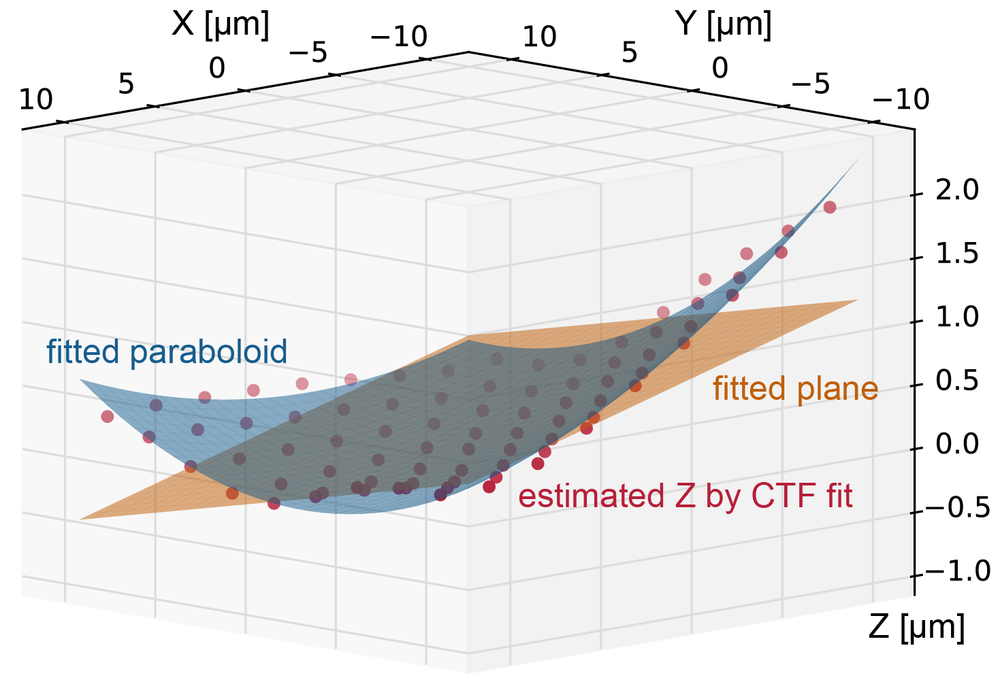

# beta
This folder contains scripts and versions that have not been extensively tested yet. Your feedback is appreciated!

### PACEtomo.py [v1.3]
- This update includes a new optional geoRefine procedure to refine the geometrical sample model. GeoRefine uses the defocus estimated by SerialEM's CTFfind at every position's start tilt angle record image. Using these defoci it fits a plane or a paraboloid and overwrites the user given plane. Results are very much dependent on the reliability of the CTFfit and overall are probably only worth it for large collection areas (7x7 holes or more, see figure of 9x9 fit below) yielding nice FFTs. This feature was not extensively tested yet! Please use at your own discretion! Feedback and bug reports are appreciated! 

  

- Usage: Set *geoRefine* to *True*. PACEtomo will fit the CTF after the first Record images are taken and only use values that show a fit better than the *fitLimit* value. If 3 points or more remain it will fit a plane, if *parabolTh* (default: 9) or more values remain, it will fit a paraboloid.
- Other changes:
  - Added progress bar and remaining time estimate.
  - Added *zeroExpTime* setting to set deviating exposure time for the start tilt image.
  - Added *checkDewar* and *doCtfFind* options to turn them off in case they cause problems.
  - Minor text fixes.

### PACEtomo_selectTargets.py [v1.4]
- Small update to the target selection script, which still needs some more testing.
- Changes:
  - Draws beam at tilted stage (ellipse) around targets during manual selection using the *beamDiameter* and the *maxTilt* settings. If the *beamDiameter* is set to 0 the script will attempt to read it from the microscope illuminated area value, which is only available on Thermo Scientific microscopes like the Krios. **WARNING:** To draw the beam diameter this script will add a polygon item to the navigator file and reload the navigator. Be careful and maybe make a backup of the navigator file to be safe!
  - New warning when you select a target close to the SerialEM image shift limit (default: 15 microns).
